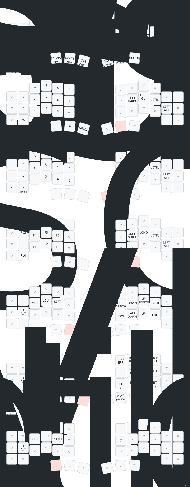

# Piantor pro BT configuration

This repository contains my ZMK configuration for a [Piantor Pro BT from
Keebart](https://www.keebart.com/products/piantor-wireless).

## layout

My layout is based on the [miryoku keyboard layout](https://github.com/manna-harbour/miryoku/tree/master).
The layout is configured with the [keymap editor](https://nickcoutsos.github.io/keymap-editor/)



## draw keymap image

Use the [keymap-drawer project](https://github.com/caksoylar/keymap-drawer) for draw an image of my keymap.

```bash
# parse config for build a yaml file
devbox run parse

# draw svg file based on previous yaml file
devbox run draw
```

## todo

- [x] configure workflow for automatically render keymap image
- [x] nav layout: `redo`, `paste`, `copy` and `undo` does not work --> removed
- [ ] add french/german letters with accent, have a look at [zmk-unicode](https://github.com/urob/zmk-unicode)
- [ ] check for macro for delete until end of line and start of line
- [ ] number: no need for have minus twice
- [ ] symbol: if use number with shift, can reach the symbols from middle
- [ ] home row mod: f + i often writes
